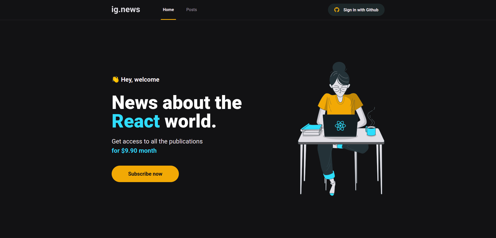
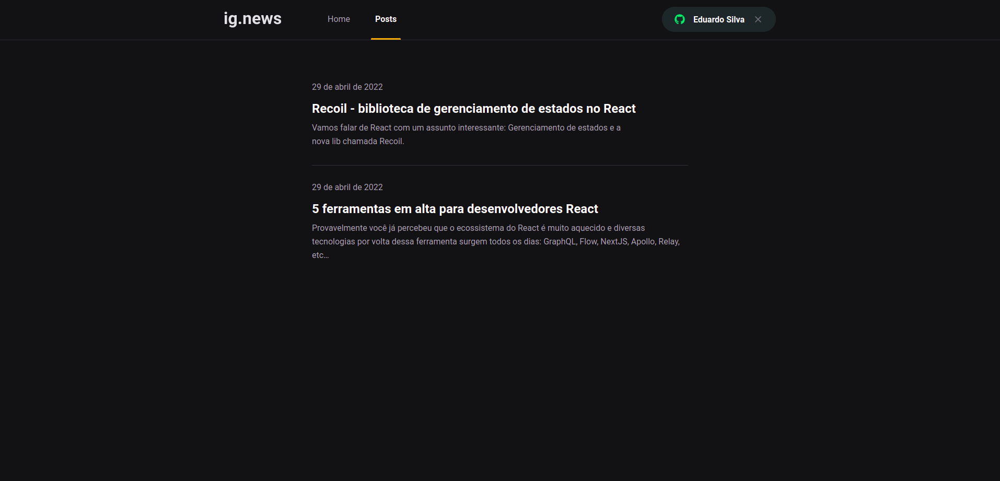
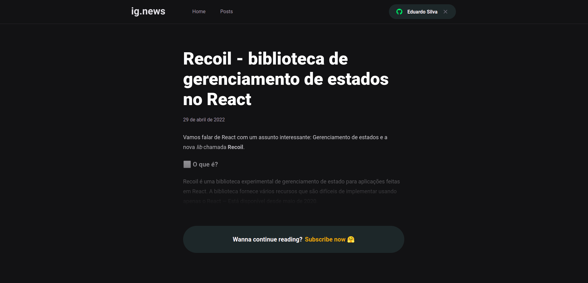
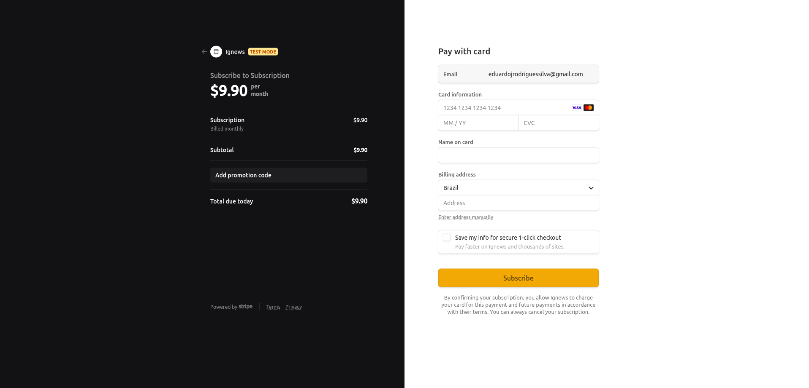

# Ig.news

Este é um projeto que utiliza NextJS, desenvolvido no Ignite da Rocketseat.

Nesse projeto foi desenvolvido uma página para publicação de posts, integrada com API de pagamentos, login com GitHub, dentre várias outras tecnologias utilizadas.

## Home

## Post List

## Post

## Subscribe
